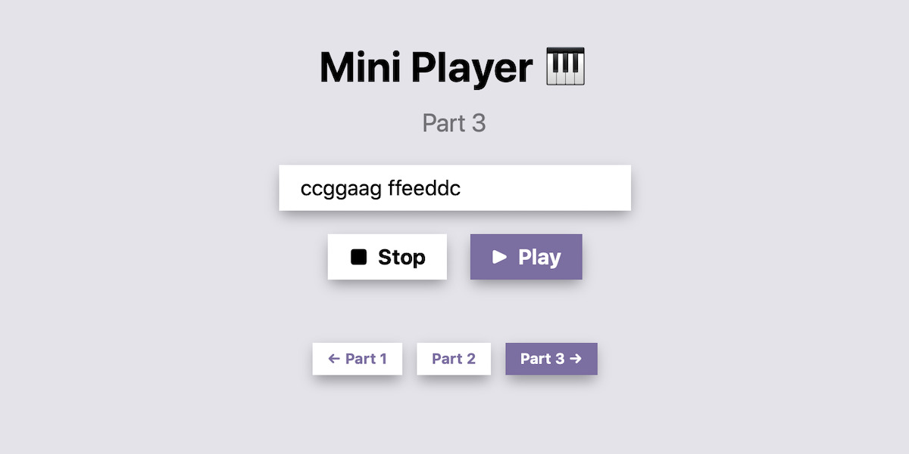

# Mini Player Workshop 🎹

Let's learn how to make music in the browser with the [Web Audio API](https://developer.mozilla.org/en-US/docs/Web/API/Web_Audio_API). You can try this workshop yourself on [**Repl.it**](https://repl.it/~) by visiting [repl.it/@thesephist/web-audio-workshop](https://repl.it/@thesephist/web-audio-workshop#README.md).



Before we dive in, you can get a peek at what you might be able to build this weekend with Web Audio by checking out [Codesynth](https://codesynth.surge.sh), a weekend project of mine from earlier this year.

## Web Audio API

Web Audio APIs think of audio as a stream of sound coming from somewhere, to somewhere. Sound is produced by some source (say, a microphone, an MP3 file, or an oscillator that makes a fixed tone), and sent to some target (an effect, a modulator, the speakers, etc.)

Because we can use the API to send sound from anywhere to anywhere, in theory, we can build up really complex chains of "nodes" that produce and transform sounds with effects in intricate ways.

But for this workshop / repl, we'll look at the simplest possible example, of a sound being produced by an "oscillator" at a single pitch, and set straight to the speakers:

```
OSCILLATOR -> SPEAKERS
```

## `AudioContext` and `Oscillator`

Every sound in the Web Audio API is produced and played within an `AudioContext`. If you've used the 2D canvas API in JavaScript, it's a bit like that -- the `AudioContext` is an object in which you make and control all sounds.

We make a new audio context by simply creating a new object:

```js
// some browsers (Safari) call it by a different name
const AudioContext = window.AudioContext || window.webkitAudioContext;

const ctx = new AudioContext();
```

The `AudioContext` is a container for our sound, but we need a sound source to produce some sound. We can use everything from a file stream to an MP3 file as a sound source, but here we'll use an [Oscillator Node](https://developer.mozilla.org/en-US/docs/Web/API/OscillatorNode).

An oscillator just produces a steady sound wave at a single constant frequency. We have a choice between several different types of waves, like `'sine'`, `'triangle'`, and `'square'`. My personal preference is towards the triangle wave.

Let's create a new oscillator in this `AudioContext` and connect it up.

```js
// create a new oscillator in this AudioContext
const oscillator = ctx.createOscillator();

// set the wave type
oscillator.type = 'triangle';

// here, we tell the browser to send the sound output from
// this oscillator to the speakers (the output destination
// of the whole AudioContext).
oscillator.connect(ctx.destination);
```

To play a sound, we need to first _start_ the oscillator, and then adjust the frequency of the note it plays. We can do it like this:

```js
// start producing sound
oscillator.start();

// here, we tell the oscillator to adjust its frequency to 440Hz
// (an "A" note), immediately.
oscillator.frequency.setValueAtTime(440, ctx.currentTime);
```

If we leave it here, the sound will play forever. If you want to stop the oscillator, you can call `.stop()` on it at any time.

```js
// stop playing after 1 second
setTimeout(() => {
    oscillator.stop();

    // if we're done making sound in the AudioContext, we should close
    // it. Note that once you stop or close a sound source, you can't
    // re-start / re-open it. You'll have to create a new one.
    ctx.close();
}, 1000);
```

What we've covered so far is what you'll find in [the first example](https://web-audio-workshop--thesephist.repl.co/basic.html).

## Notes in the major scale

Before we move onto writing a sound player that can play melodies and notes, we need to brush up on some lightweight music theory.

The common C-major scale is usually based on the "A" pitch being at 440Hz -- 440 vibrations per second. Most music uses a type of tuning called ["equal temperament tuning"](https://en.wikipedia.org/wiki/Equal_temperament), which means between the low A and high A (440Hz and 880Hz), the interval is divided into 12 equal parts, into the 12 notes in between.

If that went over your head, don't worry. The main takeaway from this bit of theory is that we can calculate the frequencies of the notes in a C major scale for our use in making music:

```js
// Notes of the C major scale
const NOTES = {
  'a': 880,
  'b': 988,
  'c': 523,
  'd': 587,
  'e': 659,
  'f': 698,
  'g': 783,
}
```

You'll also find these notes used in the [second example](https://repl.it/@thesephist/web-audio-workshop#js/intro.js).

Now, knowing a little about the Web Audio API and about notes and frequencies, we're ready to write some code to make music!

## Examples

This repl has 3 examples, of increasing complexity:

[**Part 1**](https://web-audio-workshop--thesephist.repl.co/basic.html) is a basic example of playing a simple note with the Web Audio API.

[**Part 2**](https://web-audio-workshop--thesephist.repl.co/intro.html) is a more complex example of playing multiple notes in sequence.

[**Part 3**](https://web-audio-workshop--thesephist.repl.co) has a play/pause interface with a way for the user to input notes to play into the app.

---

## References

The examples in this workshop use [paper.css](https://thesephist.github.io/paper.css/) for a clean visual style.

The audio-related code is borrowed and simplified from [Codesynth](https://github.com/thesephist/codesynth).

For more about the Web Audio API, [MDN's page on the topic](https://developer.mozilla.org/en-US/docs/Web/API/Web_Audio_API) is a great starting point.